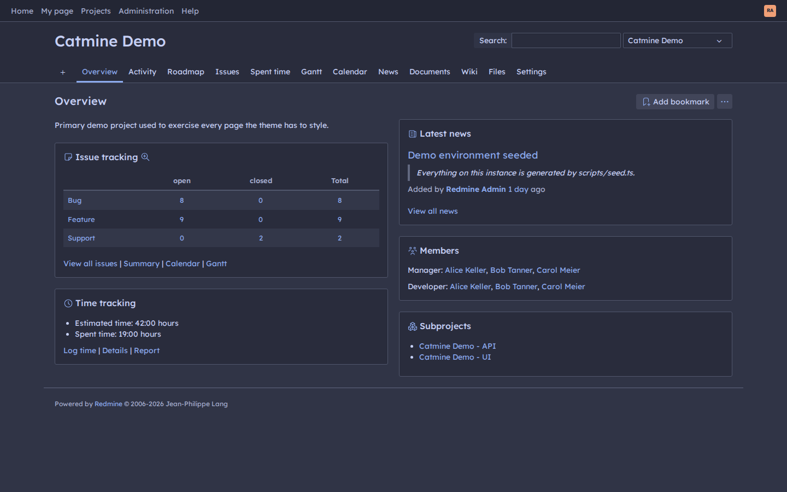
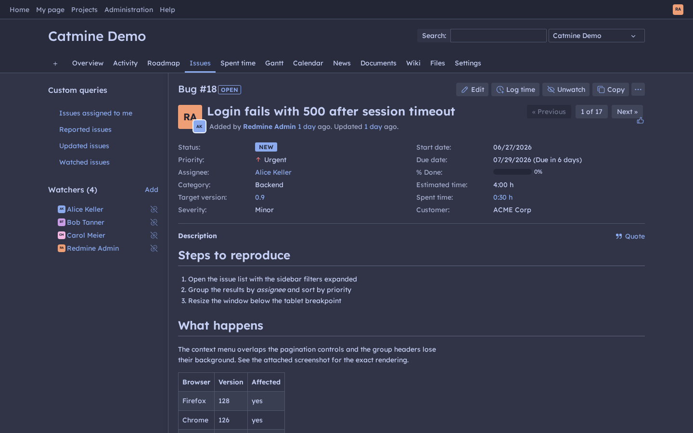
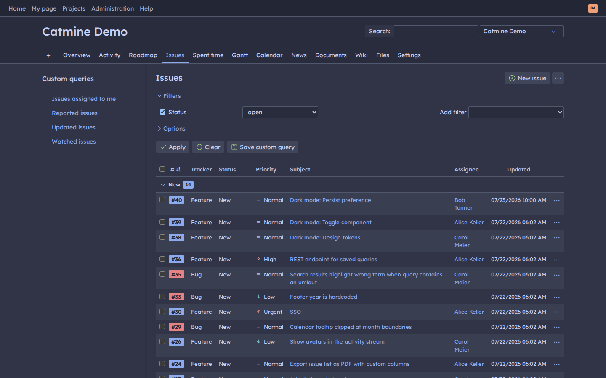
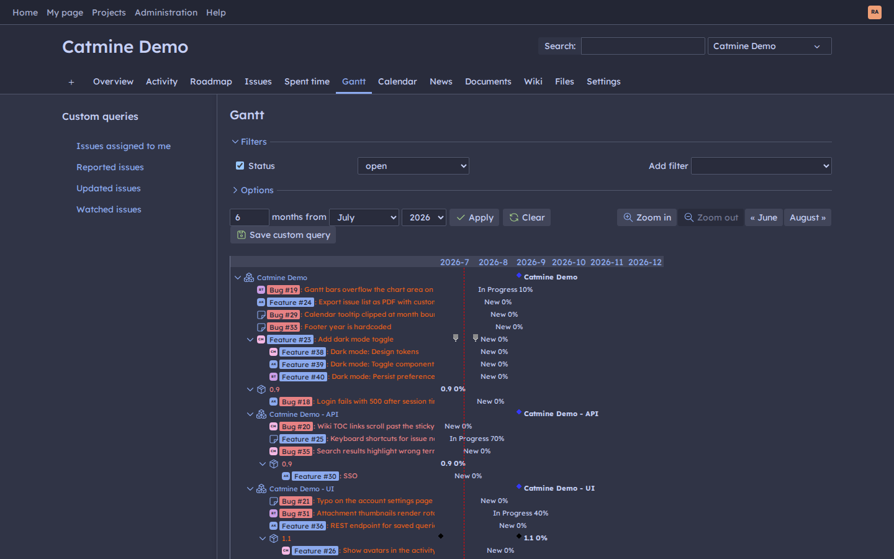

# catmine: Redmine theme

A customized build of the [Opale](https://github.com/gagnieray/opale) Redmine
theme (AGPL-3.0), targeting **Redmine 7**. Dark, built on the
[Catppuccin Frappé](https://catppuccin.com/palette) palette.

<table>
  <tr>
    <td></td>
    <td></td>
  </tr>
  <tr>
    <td></td>
    <td></td>
  </tr>
</table>

This repo is for *developing* the theme. To just install it, see
[`src/README.md`](src/README.md), which ships inside the release archive. See
[`DEVELOPMENT.md`](DEVELOPMENT.md) for the day-to-day dev workflow: building, the
edit loop, screenshots, updating upstream, and releasing.

## Install

Download the latest `catmine-<version>.tar.gz` from the
[GitHub releases](https://github.com/raeffs/catmine/releases), unpack it
into your Redmine instance's `themes/` directory, and restart Redmine. The
archive bundles install notes in `src/README.md`. This repo is developed on
Forgejo and mirrored to GitHub, which hosts the releases.

## Colours

The palette is [Catppuccin Frappé](https://catppuccin.com/palette), in
`src/custom/_palette.scss` as `$ctp-*` variables. Links, active states, progress
bars, focus rings and the header hairline all read from the single `$accent`
variable. Change that one line to another Frappé accent (`$ctp-mauve`,
`$ctp-teal`, …) to re-accent the whole theme.

Opale is light-first; catmine goes dark by redefining `$white` and `$black` as
Frappé crust and text, inverting Opale's `shade()` ramp everywhere. What that
inversion gets wrong is re-stated in `src/custom/_workarounds.scss`. The
checklist to re-run after bumping the submodule lives in
[`DEVELOPMENT.md`](DEVELOPMENT.md#after-bumping-the-opale-submodule).

## Licensing

Opale is **AGPL-3.0**; this derived build carries the same licence, so keep
[`LICENSE`](LICENSE) intact. The vendored components under
`src/opale/src/sass/vendor/` (Normalize.css, Bootstrap mixins, Tabler Icons) are
MIT-licensed with their notices preserved upstream, as are the Tabler Icons
webfonts in the build output.

The self-hosted webfonts (**Lexend** for body text, **Fantasque Sans Mono** for
code) are under the **SIL Open Font License 1.1**; their licence files ship in
`src/webfonts/` and the build packages them alongside the fonts. The
**Catppuccin Frappé** palette values come from the
[Catppuccin](https://github.com/catppuccin/catppuccin) project (MIT). See
[`NOTICE`](NOTICE) for the full attribution summary.
